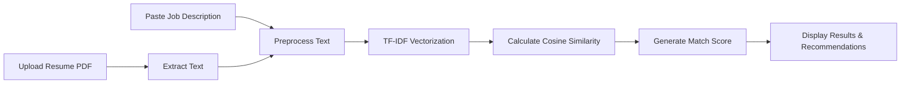
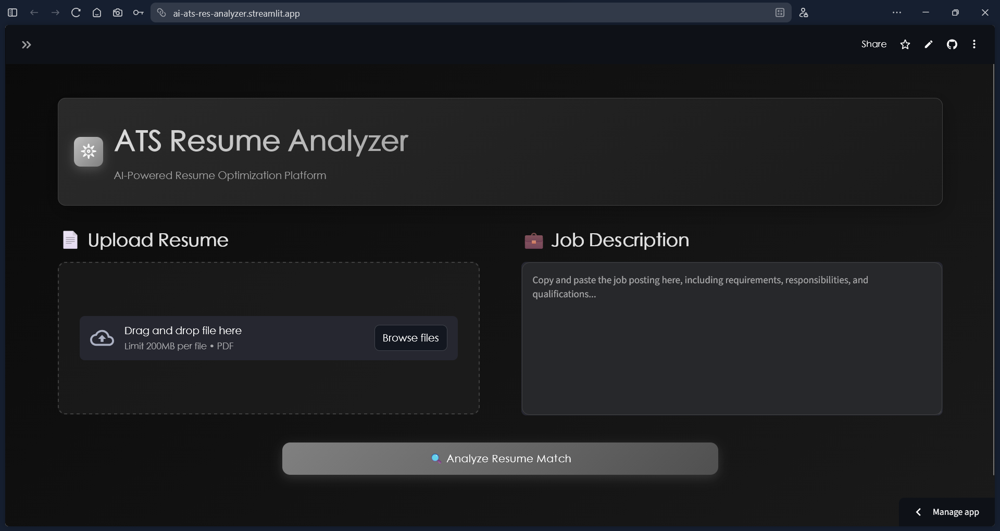
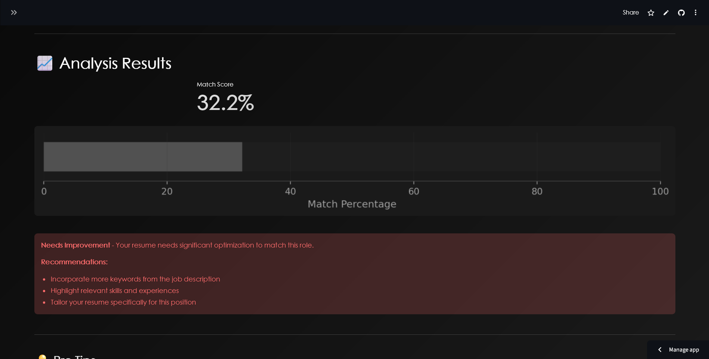

# 𖤓 ATS Resume Analyzer

> **AI-Powered Resume Optimization Platform** - Analyze and optimize your resume to beat Applicant Tracking Systems (ATS) and land more interviews.

[](https://ai-ats-res-analyzer.streamlit.app/)
[](https://www.python.org/)
[](https://opensource.org/licenses/MIT)

---

## 📋 Table of Contents

- [Overview](#overview)
- [Features](#features)
- [Demo](#demo)
- [How It Works](#how-it-works)
- [Installation](#installation)
- [Usage](#usage)
- [Tech Stack](#tech-stack)
- [Screenshots](#screenshots)
- [Contributing](#contributing)
- [License](#license)
- [Contact](#contact)

---

## 🌟 Overview

**ai-ats-res-analyzer** is a powerful web application that helps job seekers optimize their resumes for Applicant Tracking Systems. Using advanced Natural Language Processing (NLP) and Machine Learning algorithms, it analyzes your resume against job descriptions to provide actionable insights and improve your chances of getting past ATS filters.

### Why Use This Tool?

- ✅ **Beat ATS Systems** - Over 75% of resumes never reach human recruiters due to ATS filters
- ✅ **Get Instant Feedback** - Receive immediate analysis and recommendations
- ✅ **Data-Driven Insights** - See exactly how well your resume matches job requirements
- ✅ **Free & Easy** - No sign-up required, completely free to use

---

## ✨ Features

### 🔍 **Smart Analysis**
- Advanced TF-IDF (Term Frequency-Inverse Document Frequency) algorithm
- Cosine similarity scoring for precise matching
- Keyword extraction and comparison

### 📊 **Visual Insights**
- Interactive match score visualization
- Color-coded performance indicators
- Clean, modern dark-themed interface

### 💡 **Actionable Recommendations**
- Identify missing keywords from job descriptions
- Get specific suggestions for improvement
- Learn ATS best practices

### 🎨 **Modern UI/UX**
- Sleek black, grey, and silver color scheme
- Responsive design for all devices
- Intuitive drag-and-drop interface

---

## 🎬 Demo

**Try it live:** [ai-ats-res-analyzer](https://ai-ats-res-analyzer.streamlit.app)

### Quick Start:
1. Upload your resume (PDF format)
2. Paste the job description
3. Click "Analyze Resume Match"
4. Get instant feedback and recommendations

---

## 🔬 How It Works



### Technical Process:

1. **Text Extraction**: Extracts text from uploaded PDF resume
2. **Preprocessing**: 
   - Converts text to lowercase
   - Removes special characters and numbers
   - Tokenizes text into words
   - Removes stop words (common words like "the", "is", "and")
3. **Vectorization**: Converts text to numerical vectors using TF-IDF
4. **Similarity Calculation**: Computes cosine similarity between resume and job description
5. **Scoring**: Provides a match percentage (0-100%)
6. **Recommendations**: Generates personalized feedback based on score

---

## 🚀 Installation

### Prerequisites

- Python 3.8 or higher
- pip package manager

### Local Setup

1. **Clone the repository**
   ```bash
   git clone https://github.com/yashmishra11/ai-ats-res-analyzer.git
   cd ai-ats-res-analyzer
   ```

2. **Install dependencies**
   ```bash
   pip install -r requirements.txt
   or
   python -m pip install -r requirements.txt
   ```

3. **Run the application**
   ```bash
   streamlit run app.py
   ```

4. **Open your browser**
   ```
   Navigate to: http://localhost:8501
   ```

---

## 💻 Usage

### Basic Usage

```bash
# Run the app
streamlit run app.py
```

### Advanced Options

```bash
# Run on a specific port
streamlit run app.py --server.port 8080

# Run on network (accessible from other devices)
streamlit run app.py --server.address 0.0.0.0
```

### Example Workflow

1. **Prepare Your Resume**
   - Ensure your resume is in PDF format
   - Use standard fonts (Arial, Calibri, Times New Roman)
   - Avoid complex formatting (tables, text boxes, images)

2. **Find a Job Posting**
   - Copy the complete job description
   - Include requirements, responsibilities, and qualifications

3. **Analyze**
   - Upload your resume
   - Paste the job description
   - Click "Analyze Resume Match"

4. **Review Results**
   - Check your match score
   - Read the recommendations
   - Identify missing keywords

5. **Optimize**
   - Update your resume based on feedback
   - Re-analyze to track improvement
   - Repeat until you achieve a high match score (70%+)

---

## 🛠️ Tech Stack

### Frontend
- **Streamlit** - Web application framework
- **Custom CSS** - Modern dark theme styling

### Backend & ML
- **Python** - Core programming language
- **scikit-learn** - Machine learning library
  - TfidfVectorizer - Text vectorization
  - cosine_similarity - Similarity calculation
- **NLTK** - Natural Language Processing
  - Tokenization
  - Stop words removal
  - POS tagging

### Data Processing
- **PyPDF2** - PDF text extraction
- **pandas** - Data manipulation
- **NumPy** - Numerical operations

### Visualization
- **Matplotlib** - Chart generation
- **Streamlit Charts** - Interactive visualizations

---

## 📸 Screenshots

### Main Interface


### Analysis Results


### Match Score Visualization


---

## 🤝 Contributing

Contributions are welcome! Here's how you can help:

1. **Fork the repository**
2. **Create a feature branch**
   ```bash
   git checkout -b feature/AmazingFeature
   ```
3. **Commit your changes**
   ```bash
   git commit -m 'Add some AmazingFeature'
   ```
4. **Push to the branch**
   ```bash
   git push origin feature/AmazingFeature
   ```
5. **Open a Pull Request**

### Ideas for Contribution

- 🔧 Add support for DOCX files
- 🌐 Multi-language support
- 📊 Advanced analytics dashboard
- 🤖 AI-powered resume suggestions
- 📱 Mobile app version
- 🔍 Keyword density analysis
- 💾 Save/load previous analyses
- 📧 Email report generation

---

## 👨‍💻 Author

**Yash Mishra**

- GitHub: [@yashmishra11](https://github.com/yashmishra11)
- LinkedIn: [Your LinkedIn Profile](https://linkedin.com/in/yourprofile)
- Email: mr.yashofficial1102@gmail.com

---

## 🙏 Acknowledgments

- Inspired by the need to help job seekers navigate ATS systems
- Built with [Streamlit](https://streamlit.io/)
- ML algorithms powered by [scikit-learn](https://scikit-learn.org/)
- NLP processing with [NLTK](https://www.nltk.org/)

---

## 📊 Project Stats

- 🌟 **Stars**: Give this project a star if you found it helpful!
- 🍴 **Forks**: Feel free to fork and customize for your needs
- 🐛 **Issues**: Report bugs or request features in the Issues tab

---

## 🔮 Future Roadmap

- [ ] Add keyword density visualization
- [ ] Support for multiple file formats (DOCX, TXT)
- [ ] Resume template recommendations
- [ ] Industry-specific optimization
- [ ] Chrome extension for LinkedIn profiles
- [ ] API for integration with other tools
- [ ] Resume builder integration
- [ ] A/B testing for different resume versions

---

## 📚 Resources

### Learn More About ATS
- [How ATS Works](https://www.jobscan.co/blog/8-things-you-need-to-know-about-applicant-tracking-systems/)
- [ATS-Friendly Resume Tips](https://www.indeed.com/career-advice/resumes-cover-letters/ats-resume)
- [Resume Optimization Guide](https://www.themuse.com/advice/beat-the-robots-how-to-get-your-resume-past-the-system-into-human-hands)

### Related Projects
- [Resume Parser](https://github.com/OmkarPathak/pyresparser)
- [Resume Matcher](https://github.com/srbhr/Resume-Matcher)

---

## ⚖️ Disclaimer

This tool is designed to help optimize resumes for ATS systems. While it provides data-driven insights, it should be used as a guide alongside your own judgment and professional advice. Always ensure your resume accurately represents your skills and experience.

---

<div align="center">

**Made with ❤️ and ☕**

If this project helped you, consider giving it a ⭐!

[⬆ Back to Top](#-ats-resume-analyzer)

</div>
